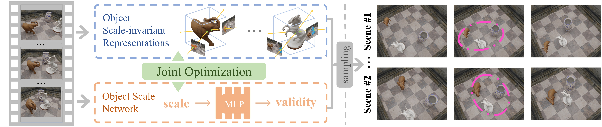

[](https://arxiv.org/abs/2407.05615)

[](https://creativecommons.org/licenses/by-nc-sa/4.0/legalcode)
[](https://twitter.com/vLAR_Group)

## OSN: Infinite Representations of Dynamic 3D Scenes from Monocular Videos (ICML 2024)
[Ziyang Song](https://szy-young.github.io/), [Jinxi Li](https://scholar.google.com/citations?user=agnxFRoAAAAJ&hl=zh-CN), [Bo Yang](https://yang7879.github.io/)

### Overview

We propose the first framework to represent dynamic 3D scenes in infinitely many ways from a monocular RGB video.



Our method enables infinitely sampling of different 3D scenes that match the input monocular video in observed views:


## 1. Environment

Please first install a **GPU-supported pytorch** version which fits your machine.
We have tested with pytorch 1.13.0.

Then please refer to [official guide](https://github.com/facebookresearch/pytorch3d/blob/main/INSTALL.md) and install **pytorch3d**. 
We have tested with pytorch3d 0.7.5.

Install other dependencies:
```shell script
pip install -r requirements
```


## 2. Data preparation

Our processed datasets can be downloaded from [Google Drive](https://drive.google.com/file/d/134MxLJwvxVGLXOXolnn_ZM-f93bt1lVq/view?usp=sharing). 

If you want to work on your own dataset, please refer to [data preparation guide](data_prepare/DATA_PREPARE.md).


## 3. Pre-trained models

You can download all our pre-trained models from [Google Drive](https://drive.google.com/file/d/1KSdesRBbnmkqxpQillLIjXN5UgbD3uOe/view?usp=sharing). 

## 4. Train

```shell script
python train.py config/indoor/chessboard.yaml --use_wandb
```
Specify `--use_wandb` to log the training with WandB. 


## 5. Test

### Sample valid scales

```shell script
python sample.py config/indoor/chessboard.yaml --checkpoint ${CHECKPOINT}
```
`${CHECKPOINT}` is the checkpoint iterations to be loaded, *e.g.*, 30000.

### Render

```shell script
python test.py config/indoor/chessboard.yaml --checkpoint ${CHECKPOINT} --n_sample_scale_test 1000 --scale_id ${SCALE_ID} --render_test
```
Specify `--render_test` to render testing views, otherwise render training views.

### Evaluate

```shell script
python evaluate.py --dataset_path ${DATASET_PATH} --render_path ${RENDER_PATH} --split test --eval_depth --eval_segm --mask
```
Specify `--eval_depth` to evaluate depth, `--eval_segm` to evaluate segmentation, `--mask` to apply co-visibility mask as in [DyCheck](https://hangg7.com/dycheck/).


## Citation
If you find our work useful in your research, please consider citing:
    
    @article{song2024,
      title={{OSN: Infinite Representations of Dynamic 3D Scenes from Monocular Videos}},
      author={Song, Ziyang and Li, Jinxi and Yang, Bo},
      journal={ICML},
      year={2024}
    }